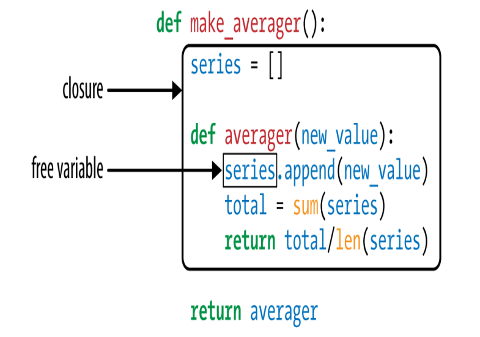

## Decorators

### Decorators 101

Decorators are a way to modify or enhance existing functions in a non-intrusive and maintainable way. They are a form of
metaprogramming as they allow a function to be modified before and after its execution. They are a very powerful tool in
Python and can be used in many different ways.

Three essential facts make a good summary of what decorators are:

1. A decorator is a function or another callable
2. A decorator may replace the decorated function with another different one.
3. Decorators are executed immediately when a module is loaded.

## Closures

A closure is a function that retains the bindings of the free variables that exist when the function is defined, so that
they can be used later when the function is invoked and the defining scope is no longer available. A closure is a record
storing a function together with an environment.



You can use python's `nonlocal` keyword to indicate that a variable is not local.

```python
def make_averager():
    count = 0
    total = 0

    def averager(new_value):
        nonlocal count, total
        count += 1
        total += new_value
        return total / count

    return averager
```

## Memoization with functools.cache

The `functools` module in the standard library provides the `@cache` decorator, which implements memoization.

```python
from functools import cache


@cache
def fibonacci(n):
    if n < 2:
        return n
    return fibonacci(n - 2) + fibonacci(n - 1)
```

## Generic Functions with Single Dispatch

The `functools.singledispatch` decorator allows different modules to contribute to the overall solution, and lets you
easily provide a specialized functions even for types that belong to third party packages that you can’t edit.
If you decorate a plain function with `@singledispatch`, it becomes the entry point for a generic function: a group of
functions to perform the same operation in different ways, depending on the type of the type of the first argument.

```python
from functools import singledispatch


@singledispatch
def base_func(arg):
    print(f"base_func({arg!r})")


@base_func.register
def _(arg: int):
    print(f"base_func({arg!r}) is an int")


@base_func.register
def _(arg: list):
    print(f"base_func({arg!r}) is a list")


@base_func.register(complex)
def _(arg: complex):
    print(f"base_func({arg!r}) is a complex")
```

## Parameterized Decorators


